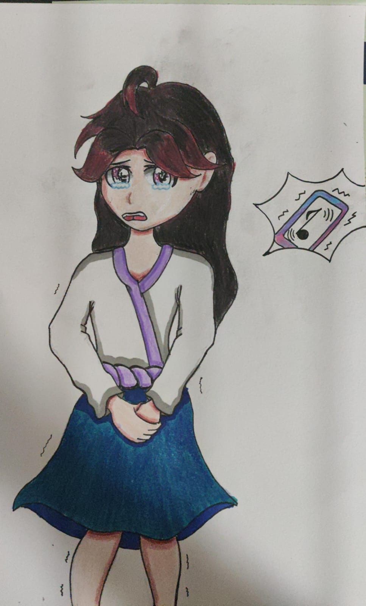
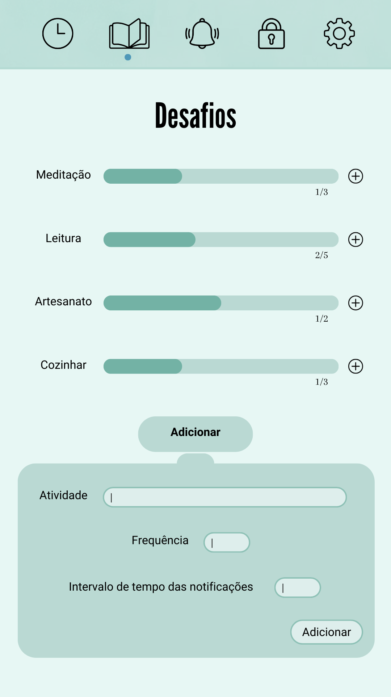
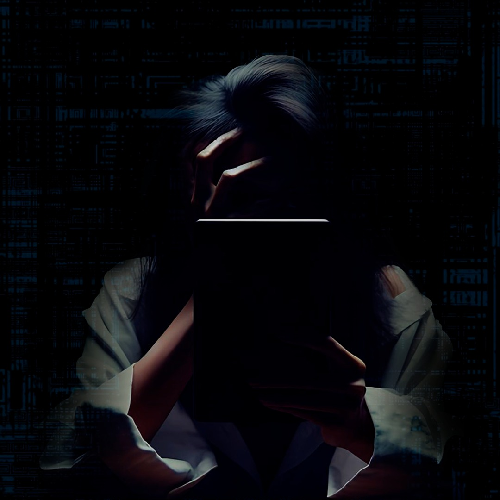
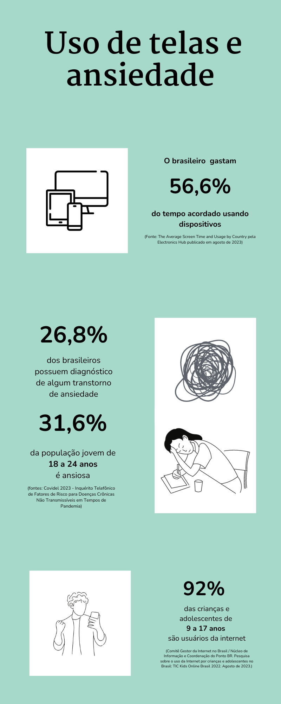

# Projeto Final - Criação de Conteúdo Web - FATEC | Sistemas para Internet | 1º Ciclo

Bem-vindo à documentação do Projeto Final da disciplina de Criação de Conteúdo Web, ministrada na FATEC Rubens Lara no curso de Sistemas para Internet, primeiro ciclo.

## Descrição do Projeto

O objetivo deste projeto é criar um conteúdo web hipotético para um cliente (empresa). Optamos por abordar a temática "O uso de telas e redes sociais na contribuição da ansiedade social em jovens" e desenvolvemos a empresa fictícia E-Calm.

A E-Calm é uma empresa dedicada ao bem-estar virtual, focada no desenvolvimento de aplicativos e extensões web para monitorar o tempo de tela, gerar relatórios e estatísticas detalhadas. Além disso, oferece fóruns e plataformas de apoio para compartilhamento de experiências e busca de ajuda especializada. Nossa missão é promover um equilíbrio saudável entre o mundo digital e a vida offline, fornecendo ferramentas e comunidades que incentivam hábitos conscientes e positivos no uso da tecnologia.

### Público-Alvo

Nosso foco é atender crianças, adolescentes e jovens, especialmente aqueles que lidam com transtornos de ansiedade ou vício em telas. Também direcionamos nossos serviços para pais, educadores e profissionais da área da psicologia.

### Persona - Anna

Pensando no público-alvo, criamos a persona Anna, uma adolescente de 14 anos que cresceu imersa no mundo digital. Sua dependência evoluiu para ansiedade, resultando em inseguranças sobre aparência e dificuldade em interações sociais presenciais. A escola alertou os pais sobre seus comportamentos ansiosos, e seu medo inclui ficar sem o celular e enfrentar interações sociais. Nosso objetivo é auxiliar Anna a equilibrar o uso de telas, melhorar a autoestima e facilitar interações sociais mais positivas.

#### Design da Persona

O design desta personagem é meticulosamente construído com ênfase nas cores escolhidas, as quais transmitem significados importantes. Inicialmente, destaca-se o cabelo, onde as mechas vermelhas não apenas seguem uma tendência popular entre as jovens, mas também simbolizam a ansiedade intensa que a personagem experimenta em relação ao seu celular.

As roupas desempenham um papel crucial na narrativa visual, harmonizando-se para comunicar uma mensagem clara: a garota é extremamente tímida, introvertida e insegura. O branco, representando a timidez, o azul escuro, simbolizando a introversão, e o lilás, indicando a insegurança, trabalham em conjunto para criar uma representação visual coesa desses traços de personalidade. Cada cor desempenha um papel sutil, contribuindo para a expressão emocional da personagem.

### Aplicativo: TimeWise

Pensando no cenário de constante interação digital, desenvolvemos o TimeWise para promover o uso consciente de dispositivos eletrônicos. A cada 20 minutos em um aplicativo, um pop-up em tempo real revela o tempo utilizado, estabelecendo metas diárias com bloqueio ao atingi-las. Relatórios semanais detalham o tempo de tela e uso do celular, sendo o aplicativo versátil e compatível com celulares, tablets e desktops.

Além disso, o TimeWise transforma cada hora de uso do celular em oportunidade, gerando atividades como desafios de origami ou leituras curtas. Com funcionalidades simples e eficazes, buscamos promover um equilíbrio saudável entre a vida digital e a real.

Layout do aplicativo:

.png)

### Sobre o site:

O site foi criado utilizando a plataforma Figma e fazendo uso da paleta de cores #385659, #A7D9CB , #F2F2F2, #91D2D9, #C1D9D4, #FFFFFF, #000000. Essas cores foram escolhidas para harmonizar com as utilizadas no aplicativo, buscando criar uma atmosfera de calma e tranquilidade, apesar de o tema expressar sensações opostas. 
Os ícones gráficos do site, provenientes do Flaticon, foram utilizados para compor alguns elementos do infográfico, o menu do site e os elementos da região onde os desenvolvedores são apresentados.

A fonte escolhida foi a Roboto, utilizando suas versões extrabold para títulos, itálico para subtítulos e light para o corpo do texto. Essa escolha foi feita devido à sua legibilidade e popularidade como uma fonte comum.

Confira o site:
[Site e-calm](assets/e-calm.pdf)

### Imagem autoral
A imagem foi gerada por inteligência artificial, seguindo instruções para expressar a ansiedade associada ao uso de tecnologias. Posteriormente, foi editada no Photoshop para inserir códigos de programação de forma discreta e suave em seu fundo.

### Infográfico

O infográfico foi elaborado na plataforma Canvas, utilizando as paletas de cores #A7D9CB, #FFFFFF, #000000, e incorpora informações provenientes de diversas fontes, referenciadas diretamente na imagem.

### Design do Aplicativo

O aplicativo foi desenvolvido através do aplicativo Canvas, utilizando a paleta de cores: #B6DBD4, #E7F7F4, #BAD9D3, #F6FCFC, #000000. O objetivo era transmitir a ideia de calma e proporcionar uma experiência confortável e minimalista, inspirando-se no layout de diversos aplicativos já existentes no mercado.
 
 

 ### Vídeo

 O vídeo foi integralmente produzido no ambiente do Canvas, utilizando recursos como imagens, GIFs e desenhos disponibilizados pela própria aplicação. Na apresentação, optei por utilizar uma voz gerada por inteligência artificial, tanto para a entrevista quanto para a exposição dos temas e do aplicativo.

Para a seção de entrevista, elaboramos as perguntas em formato escrito e contamos com a colaboração de uma colega do grupo. Posteriormente, converti o conteúdo para voz por meio da assistência de IA, proporcionando uma experiência mais dinâmica e envolvente. No que diz respeito à trilha sonora, escolhi músicas de plataformas que disponibilizam conteúdo gratuitamente. 

Assista ao vídeo: 
[Vídeo](assets/O%20uso%20de%20telas%20e%20redes%20sociais%20na%20contribuição%20da%20ansiedade%20social%20em%20jovens.%20(2).mp4)
